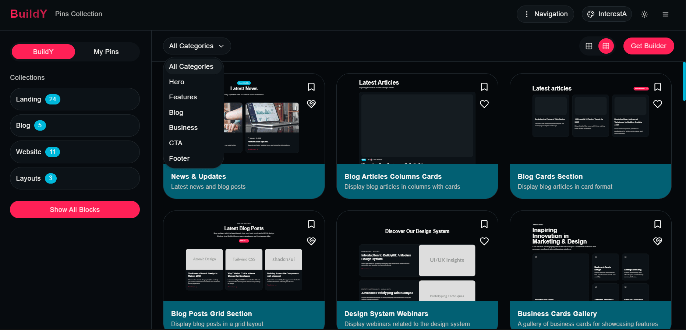

# BuildY/UI - Drag & Drop Page Builder with shadcn/ui

A modern, fully customizable drag-and-drop page builder built with React, Vite, and shadcn/ui. Create beautiful landing pages with a simple interface, export them as HTML, and customize themes to match your brand.



## ✨ Features

- **Drag & Drop Interface**: Easily arrange and customize page blocks
- **Theme Customization**: Full support for shadcn/ui theming system
- **Dark/Light Mode**: Built-in support for both light and dark modes
- **Custom Theme Import**: Import themes from [tweakcn.com](https://tweakcn.com/) or custom JSON
- **Project Export/Import**: Save and share your projects as JSON files
- **HTML Export**: Generate static HTML files ready for deployment
- **Responsive Design**: All components are fully responsive
- **Modern UI Components**: Built with shadcn/ui for a consistent look and feel


## 🚀 Getting Started

### Prerequisites

- Node.js 18+ and npm/yarn/pnpm/bun
- Git

### Installation

1. Clone the repository:

```bash
git clone https://github.com/alexy-os/page-builder.git
cd buildy-ui
```

2. Install dependencies:

```bash
npm install
# or
yarn
# or
pnpm install
# or
bun install
```

3. Start the development server:

```bash
npm run dev
# or
yarn dev
# or
pnpm dev
# or
bun dev
```

4. Open your browser and navigate to `http://localhost:5173`

## 🎨 Theme Customization

BuildY/UI uses shadcn/ui's theming system, allowing for complete customization of colors, typography, and more.

### Using Built-in Themes

The app comes with several built-in themes that you can switch between using the theme selector in the top navigation bar.

### Importing Custom Themes

1. Click on the menu icon in the top right corner
2. Select "Import Theme"
3. Paste your theme JSON (compatible with shadcn/ui theme format)
4. Click "Import Theme"

You can create custom themes using [tweakcn.com](https://tweakcn.com/) or by manually crafting a theme JSON with the following structure:

```json
{
  "cssVars": {
    "theme": {
      "background": "oklch(0.9707 0.0027 286.3504)",
      "foreground": "oklch(0.2316 0.0038 286.0989)",
      "primary": "oklch(0.6028 0.2177 257.4239)",
      ...
    },
    "light": {
      "background": "oklch(0.9707 0.0027 286.3504)",
      "foreground": "oklch(0.2316 0.0038 286.0989)",
      ...
    },
    "dark": {
      "background": "oklch(0.2178 0 0)",
      "foreground": "oklch(0.9067 0 0)",
      ...
    }
  }
}
```

## 📦 Project Export/Import

### Exporting Projects

1. Click on the menu icon in the top right corner
2. Select "Export Project"
3. Save the JSON file to your computer

### Importing Projects

1. Click on the menu icon in the top right corner
2. Select "Import Project"
3. Paste your project JSON or upload a file
4. Click "Import"

### Exporting as HTML

1. Click on the menu icon in the top right corner
2. Select "Export HTML"
3. Save the HTML file to your computer

The exported HTML includes:
- All your page blocks
- The selected theme's CSS variables
- Required Google Fonts (if any)
- A simple theme toggle for dark/light mode

## 🧩 Available Blocks

BuildY/UI comes with several pre-built blocks:

- **Hero**: Full-screen hero section with image background
- **Hero Center**: Centered hero section with badge and buttons
- **Features**: Grid of features with icons
- **CTA (Call to Action)**: Compelling call-to-action section
- **News**: Blog posts or news articles display
- **Footer**: Complete footer with links and social icons

## 🛠️ Technical Details

BuildY/UI is built with:

- **React 19**: For the UI components
- **Vite 7**: For fast development and building
- **TypeScript**: For type safety
- **shadcn/ui**: For UI components and theming
- **Tailwind CSS 4**: For styling
- **@hello-pangea/dnd**: For drag and drop functionality
- **Lucide React**: For icons

## 📝 License

This project is licensed under the MIT License - see the LICENSE file for details.

---

Built with ❤️ by [[buildy/ui](https://github.com/buildy-ui/ui)
